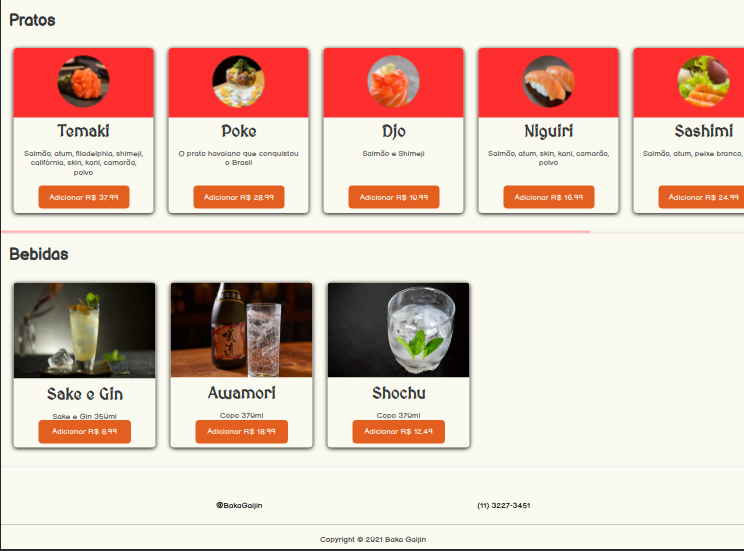

# Baka Gaijin

Exercício simples de React para praticar Componentização, Props e UseState.

Link do [Github](https://github.com/HumbertoSilv/Baka-gaijin) 

Link do [Baka Gaijin](https://bakagaijin.vercel.app/)

